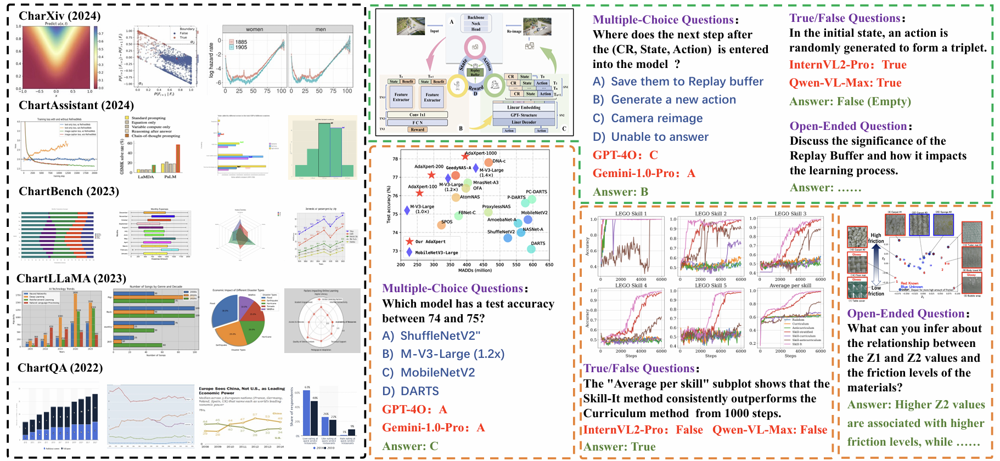

<!-- The official repository of the paper named 'Rethinking Comprehensive Benchmark for Chart Understanding: A Perspective from Scientific Literature' -->

#  Rethinking Comprehensive Benchmark for Chart Understanding: A Perspective from Scientific Literature


<h5 align="center"> If you like our project, please give us a star ⭐ on GitHub for latest update. 

## News
- 24-09-05. We release the test set and validation set of SCI-CQA, which can be downloaded at HF.


# Motivation

<p align="center">
    
<p>

SCI-CQA address the limitations of current benchmarks and provide a more robust framework for evaluating the chart understanding abilities of multimodal models in scientific literature contexts.

- ✨ SCI-CQA highlights flowcharts, a crucial yet often overlooked chart type in scientific literature, addressing the gap in existing benchmarks that primarily focus on simpler chart types.
- ✨ By using real-world scientific charts with intricate visual elements, SCI-CQA offers a more accurate assessment of multimodal models, addressing the shortcomings of existing benchmarks that rely on overly simplistic elements.
- ✨ SCI-CQA introduces an evaluation framework inspired by human exams, featuring 5,629 carefully curated questions that include both objective and open-ended formats, enhancing the assessment of model understanding beyond simplistic templates.
- ✨ The benchmark emphasizes the importance of contextual information in chart understanding, demonstrating how context can help answer previously unanswerable questions, thereby setting a new standard for evaluating multimodal models.
- ✨ A new annotation pipeline is proposed that significantly reduces the costs associated with data annotation, making the process more efficient and scalable.


# Dataset 

SCI-CQA will be released in this Link. In addition, we create a large training dataset of chart understanding, which will be published here. [HF](https://huggingface.co/datasets/lyndons1/SCI-CQA).


# Evaluation
Coming Soon!


# Acknowledgement

We thank the following excellent works: [CharXiv](https://github.com/princeton-nlp/CharXiv), [ChartQA](https://arxiv.org/abs/2203.10244), and [ChartAst](https://github.com/OpenGVLab/ChartAst). SCI-CQA is inspired by previous excellent works, and we are standing on the shoulders of giants for further exploration.


#  License
* The majority of this project is released under the Apache 2.0 license as found in the [LICENSE](https://github.com/ShawnHuang497/BiRD/blob/main/LICENSE) file.
* The service is a research preview intended for non-commercial use only, subject to [Terms of Use](https://openai.com/policies/terms-of-use) of the data generated by OpenAI.
* Since all of our charts are from illustrations in the scientific literature, the original authors own the copyright.
* Please contact us if you find any potential violation.


#  Citation
If you find our paper and code useful in your research, please consider giving a star and citation.

```BibTeX

```
